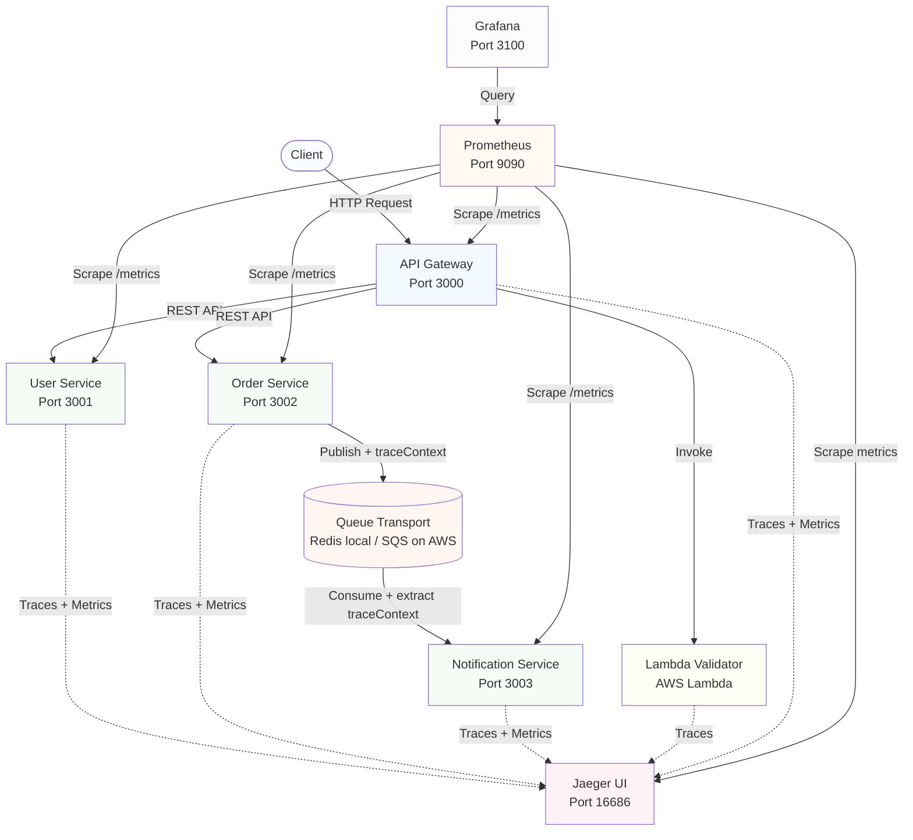

# Observability Demo — Microservices with OpenTelemetry

A portfolio project demonstrating the three pillars of observability — **traces, metrics, and logs** — across a distributed microservices system on AWS.

Covers distributed tracing across HTTP services, async queue boundaries, and serverless functions using OpenTelemetry as the single instrumentation layer.

---

## Stack

| Layer | Technology |
|-------|-----------|
| Tracing | OpenTelemetry + Jaeger |
| Metrics | Prometheus + Grafana |
| Logs | Winston + trace correlation |
| Services | TypeScript + Express (×4) + AWS Lambda |
| Queue | AWS SQS (production) / Redis (local dev) |
| Infra | Terraform + ECS Fargate + Docker Compose |

---

## Architecture



---

## Observability Pillars

### Traces (Jaeger)
Every HTTP hop and queue boundary is captured. View end-to-end traces at `http://localhost:16686`. See [Trace Propagation](#trace-propagation) below.

### Metrics (Prometheus + Grafana)
All four services expose a `/metrics` endpoint (Prometheus text format) via `@opentelemetry/exporter-prometheus` wired into the OTel SDK's `metricReader`. Jaeger's Service Performance Monitoring (SPM) is enabled with Prometheus as its backend, showing RED metrics (Rate, Errors, Duration) per service directly in the Jaeger UI.

**Built-in OTel metrics** (HTTP server duration, request count, active requests) are captured automatically via auto-instrumentation.

**Custom business metrics** per service:

| Metric | Service | Type |
|--------|---------|------|
| `gateway_requests_total` | api-gateway | Counter |
| `gateway_errors_total` | api-gateway | Counter |
| `users_created_total` | user-service | Counter |
| `orders_created_total` | order-service | Counter |
| `orders_errors_total` | order-service | Counter |
| `order_value` | order-service | Histogram |
| `notifications_sent_total` | notification-service | Counter |
| `notifications_failed_total` | notification-service | Counter |
| `notification_processing_duration_ms` | notification-service | Histogram |

Grafana at `http://localhost:3100` loads a pre-configured dashboard with RED metrics, latency percentiles (p50/p95/p99), and business metric stat panels. Credentials: `admin / admin`.

### Logs (Winston)
All services use a shared `createLogger(serviceName)` factory from `services/shared/logger`. Every log record is emitted as structured JSON and automatically includes the active span's `traceId` and `spanId`, enabling log–trace correlation in any log aggregation backend (Loki, ELK, CloudWatch).

```json
{ "level": "info", "message": "Order created", "service": "order-service",
  "traceId": "4bf92f...", "spanId": "00f067...", "orderId": 3, "total": 49.99 }
```

Set `LOG_LEVEL=debug` (default: `info`) to increase verbosity.

> **Sampling note**: this demo uses the default "always on" sampler — suitable for low-traffic demos. For production, use `ParentBasedSampler` with a `TraceIdRatioBased` sub-sampler (e.g. 10%) to control trace volume and instrumentation overhead.

---

## Trace Propagation

### HTTP (automatic)
OpenTelemetry auto-instrumentation injects `traceparent` headers into every outbound Axios request and extracts them on every incoming Express request. No manual code required.

### Async queue boundary (manual)
Queue transports have no native header mechanism. Trace context must be serialized into the message payload explicitly:

```typescript
// Order Service — inject before publishing
const carrier = {};
propagation.inject(context.active(), carrier);
await queue.publish({ ...data, traceContext: carrier });

// Notification Service — extract before processing
const ctx = propagation.extract(ROOT_CONTEXT, message.traceContext);
await context.with(ctx, async () => {
  const span = tracer.startSpan('process-notification');
  // span is a child of the original request trace
});
```

### Serverless
AWS Lambda invocations are traced via the same OTel SDK — spans appear as children of the API Gateway span in Jaeger.

---

## Pluggable Queue Transport

The queue is abstracted behind a common `IQueueTransport` interface. Transport is selected at runtime via environment variable:

```
QUEUE_TRANSPORT=redis   # local development (default)
QUEUE_TRANSPORT=sqs     # AWS production
```

| Transport | OTel propagation | Notes |
|-----------|-----------------|-------|
| SQS | Automatic via AWS Distro for OTel | Production — native to the AWS stack |
| Redis | Manual — serialized in payload | Local dev — no cloud credentials needed |
| Kafka | Automatic via `instrumentation-kafkajs` | High throughput, replay, consumer groups |
| RabbitMQ | Automatic via `instrumentation-amqplib` | Routing, exchanges, priorities |

`docker-compose.yml` sets `QUEUE_TRANSPORT=redis`. Terraform task definitions set `QUEUE_TRANSPORT=sqs` with the `SQS_QUEUE_URL` output.

---

## Trace Scenarios

| Scenario | Path | Propagation |
|----------|------|-------------|
| User lookup | API Gateway → User Service | Automatic (HTTP) |
| Order creation | API Gateway → Order Service → User Service | Automatic (HTTP) |
| Async notification | Order Service → Queue → Notification Service | Manual (payload) |
| Order validation | API Gateway → Lambda | Automatic (HTTP) |

---

## Quick Start

**Prerequisites**: Node.js 20+, Docker & Docker Compose

```bash
docker-compose up --build

# Create a user
curl -X POST http://localhost:3000/api/users \
  -H "Content-Type: application/json" \
  -d '{"name": "John Doe", "email": "john@example.com"}'

# Create an order — triggers full trace across all services
curl -X POST http://localhost:3000/api/orders \
  -H "Content-Type: application/json" \
  -d '{"userId": 1, "items": ["Product A"], "total": 49.99}'

# View traces
open http://localhost:16686
```

Service ports: API Gateway `:3000` · User `:3001` · Order `:3002` · Notification `:3003` · Jaeger UI `:16686` · Prometheus `:9090` · Grafana `:3100` (admin/admin)

---

## Project Structure

```
observability/
├── services/
│   ├── api-gateway/          # Entry point, routes requests
│   ├── user-service/         # User CRUD
│   ├── order-service/        # Order processing + queue publish
│   └── notification-service/ # Queue consumer
├── services/shared/queue/    # IQueueTransport, RedisTransport, SQSTransport
├── services/shared/logger/   # Winston logger with trace context injection
├── lambda/                   # Order validator (AWS Lambda)
├── infrastructure/terraform/ # ECS, Lambda, SQS, networking
├── configs/                  # Prometheus, Grafana provisioning, OTel config
│   ├── prometheus.yml
│   └── grafana/              # datasources.yml, dashboards.yml, dashboards/
└── docker-compose.yml
```

---

## API Reference

**Users**
```
GET  /api/users           list all users
GET  /api/users/:id       get user by ID
POST /api/users           create user — { name: string, email: string }
```

**Orders**
```
GET  /api/orders          list all orders
GET  /api/orders/:id      get order with user details
POST /api/orders          create order — { userId: number, items: string[], total: number }
```

---

## AWS Deployment

```bash
# Build and push images to ECR
export AWS_ACCOUNT_ID="your-account-id"
export AWS_REGION="us-east-1"
./infrastructure/scripts/build-and-push.sh

# Deploy
cd infrastructure/terraform
cp terraform.tfvars.example terraform.tfvars
terraform init && terraform apply

# Outputs
terraform output api_gateway_url
terraform output sqs_queue_url
```

**Estimated cost**: ~$80–100/month (ECS Fargate + ALB + NAT Gateway). Teardown: `terraform destroy`.

---

## Development

```bash
# Run a single service locally
cd services/order-service && npm install && npm run dev

# Build Lambda package
cd lambda && npm install && npm run build  # → lambda.zip
```

---

## Demonstration


---

## Notes

- ⚠️ Demo project — no auth, HTTP only, no secret management
- Set `LOG_LEVEL=debug` in any service for verbose structured JSON logs

**Documentation**: [PLAN.md](PLAN.md) · [TASKS.md](TASKS.md) · [infrastructure/terraform/README.md](infrastructure/terraform/README.md) · [lambda/README.md](lambda/README.md)

---

**Built with**: OpenTelemetry · TypeScript · Express · Jaeger · Prometheus · Grafana · Redis · AWS SQS · ECS Fargate · Lambda · Terraform

**Contact**: [jeziellcarvalho@gmail.com](mailto:jeziellcarvalho@gmail.com) · [linkedin.com/in/jezielcarvalho](https://linkedin.com/in/jezielcarvalho)
