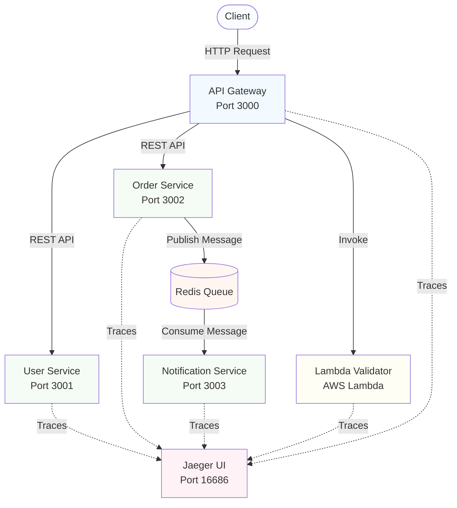

# Observability Demo - Microservices with OpenTelemetry

A portfolio project demonstrating the three pillars of observability — **traces, metrics, and logs** — across a distributed microservices system using OpenTelemetry, Prometheus, Grafana, and Jaeger on AWS.

## 🎯 Project Overview

This project showcases:
- **Microservices Architecture** - 4 TypeScript services with REST APIs
- **Distributed Tracing** - OpenTelemetry instrumentation across all services, visualized in Jaeger
- **Metrics Collection** *(in progress)* - Prometheus scraping all services + Grafana dashboards
- **Async Trace Propagation** - Trace context manually serialized through Redis queue boundaries
- **Serverless + Container Tracing** - Single unbroken trace spanning AWS Lambda and ECS services
- **Container Orchestration** - Docker Compose for local dev, ECS Fargate for production
- **Infrastructure as Code** - Terraform for AWS deployment

> **💡 Key Challenge**: Keeping a trace alive across async boundaries. HTTP propagation is automatic via OpenTelemetry — but when a message enters a Redis queue, context would be lost. The solution: manually serialize the trace context into the message payload and restore it on the consumer side, maintaining a single trace across the entire flow.

## 🧪 Demonstration


## 📊 Architecture



## 🚀 Quick Start

### Prerequisites
- Node.js 20+
- Docker & Docker Compose
- AWS CLI (for deployment)
- Terraform (for infrastructure)

### Local Development

1. **Clone and setup**
```bash
git clone <repository>
cd observability
```

2. **Start all services**
```bash
docker-compose up --build
```

3. **Access services**
- API Gateway: http://localhost:3000
- Jaeger UI: http://localhost:16686
- User Service: http://localhost:3001
- Order Service: http://localhost:3002
- Notification Service: http://localhost:3003

### Test Distributed Tracing

```bash
# Create a user
curl -X POST http://localhost:3000/api/users \
  -H "Content-Type: application/json" \
  -d '{"name": "John Doe", "email": "john@example.com"}'

# Create an order (triggers full trace across services)
curl -X POST http://localhost:3000/api/orders \
  -H "Content-Type: application/json" \
  -d '{
    "userId": 1,
    "items": ["Product A", "Product B"],
    "total": 149.99
  }'

# View trace in Jaeger
open http://localhost:16686
```

## 📁 Project Structure

```
observability/
├── services/
│   ├── api-gateway/         # Entry point service
│   ├── user-service/        # User management
│   ├── order-service/       # Order processing + queue
│   └── notification-service/ # Queue consumer
├── lambda/                  # Serverless function
│   └── src/index.ts        # Order validator
├── infrastructure/
│   └── terraform/          # AWS deployment
├── configs/                # Shared OpenTelemetry config
├── docker-compose.yml      # Local orchestration
├── PLAN.md                 # Implementation plan
└── TASKS.md               # Detailed task list
```

## 🔍 Observability Features

### The Three Pillars

| Pillar | Tool | What it covers |
|--------|------|----------------|
| **Traces** | Jaeger + OpenTelemetry | End-to-end request flow across all services |
| **Metrics** | Prometheus + Grafana *(in progress)* | Request rate, duration, error rate per service |
| **Logs** | Console + CloudWatch | Structured logs with trace correlation |

### Distributed Trace Propagation

- 📡 **HTTP Auto-instrumentation** - OpenTelemetry SDK injects/extracts context automatically on all Express & Axios calls
- 🔄 **Async Queue (the hard part)** - Trace context manually serialized into Redis message payload and restored on the consumer side
- ⚡ **Serverless** - Same trace continues into AWS Lambda invocations
- 🔗 **Single trace ID** spans HTTP services, async queue, and Lambda in one Jaeger view

**How it works:**
```typescript
// API Gateway → Order Service (automatic via headers)
await axios.get(ORDER_SERVICE_URL);  // ← traceparent header injected automatically

// Order Service → Redis → Notification Service (manual for async)
const carrier = {};
propagation.inject(context.active(), carrier);  // Extract context
await redis.lPush('queue', JSON.stringify({ ...data, traceContext: carrier }));

// Notification Service extracts and continues trace
const ctx = propagation.extract(ROOT_CONTEXT, message.traceContext);
```

The async queue boundary is where trace context propagation gets non-trivial — and where the real understanding happens.

### OpenTelemetry Instrumentation
- **Automatic**: HTTP requests, database calls, Redis operations
- **Manual**: Custom business logic spans and events
- **Context Propagation**: Traces flow across service boundaries, queues, and Lambda

### Trace Scenarios
1. **API Gateway → User Service** - Simple request flow
2. **API Gateway → Order Service → User Service** - Multi-service call
3. **Order Service → Redis → Notification Service** - Async processing
4. **API Gateway → Lambda** - Serverless integration

### Jaeger Features
- View end-to-end request traces
- Analyze service dependencies
- Identify performance bottlenecks
- Track error propagation

## 🛠️ Development

### Build individual service
```bash
cd services/api-gateway
npm install
npm run build
npm start
```

### Run in development mode
```bash
npm run dev  # Uses ts-node
```

### Build Lambda function
```bash
cd lambda
npm install
npm run build  # Creates lambda.zip
```

## ☁️ AWS Deployment

### 1. Build and push Docker images
```bash
export AWS_ACCOUNT_ID="your-account-id"
export AWS_REGION="us-east-1"

# Login to ECR
aws ecr get-login-password --region $AWS_REGION | \
  docker login --username AWS --password-stdin \
  $AWS_ACCOUNT_ID.dkr.ecr.$AWS_REGION.amazonaws.com

# Build and push
./infrastructure/scripts/build-and-push.sh
```

### 2. Deploy with Terraform
```bash
cd infrastructure/terraform
cp terraform.tfvars.example terraform.tfvars
# Edit terraform.tfvars

terraform init
terraform plan
terraform apply
```

### 3. Get endpoints
```bash
terraform output api_gateway_url
terraform output lambda_function_name
```

## 📊 Monitoring

### CloudWatch Logs
```bash
aws logs tail /ecs/observability-demo --follow
```

### Service Health
```bash
curl http://<alb-dns>/health
```

### Lambda Invocation
```bash
aws lambda invoke \
  --function-name observability-demo-order-validator \
  --payload '{"body":"{\"userId\":1,\"items\":[\"test\"],\"total\":99.99}"}' \
  response.json
```

## 🧪 Testing

### API Endpoints

**Users**
```bash
# Get all users
GET /api/users

# Get user by ID
GET /api/users/:id

# Create user
POST /api/users
{
  "name": "Jane Doe",
  "email": "jane@example.com"
}
```

**Orders**
```bash
# Get all orders
GET /api/orders

# Get order by ID (includes user data)
GET /api/orders/:id

# Create order (validates user, publishes to queue)
POST /api/orders
{
  "userId": 1,
  "items": ["Item 1", "Item 2"],
  "total": 99.99
}
```

## 🎓 Technical Stack & Features

- **OpenTelemetry** as the single vendor-neutral instrumentation layer
- **Traces** (Jaeger) + **Metrics** (Prometheus/Grafana, in progress) + **Logs** — all three pillars
- **Async trace context propagation** — manual serialization through Redis queue boundaries
- **Cross-environment tracing** — same trace across ECS containers and AWS Lambda
- TypeScript microservices with auto-instrumentation
- Container orchestration (Docker Compose + ECS Fargate)
- Infrastructure as Code (Terraform)

## 📝 Documentation

- [PLAN.md](PLAN.md) - Overall strategy and architecture decisions
- [TASKS.md](TASKS.md) - Detailed implementation checklist
- [infrastructure/terraform/README.md](infrastructure/terraform/README.md) - Deployment guide
- [lambda/README.md](lambda/README.md) - Lambda function details

## 💰 Cost Estimation (AWS)

- **ECS Fargate**: ~$30-50/month (minimal CPU/memory)
- **ALB**: ~$16/month
- **NAT Gateway**: ~$32/month
- **Lambda**: Free tier eligible
- **CloudWatch**: Free tier eligible

**Total**: ~$80-100/month (can be reduced using spot instances)

## 🧹 Cleanup

### Local
```bash
docker-compose down -v
```

### AWS
```bash
cd infrastructure/terraform
terraform destroy
```

## 🔐 Security Notes

⚠️ **This is a demo project** - not production-ready:
- No authentication/authorization
- Public ALB with HTTP only
- No secret management
- Basic security groups
- No WAF or DDoS protection

## 🤝 Contributing

This is a portfolio project, but feedback is welcome!

## 📄 License

MIT

## 🙋 Contact

Portfolio project by Jeziel Lopes
- Email: [jeziellcarvalho@gmail.com](mailto:jeziellcarvalho@gmail.com)
- LinkedIn: [https://linkedin.com/in/jezielcarvalho](https://linkedin.com/in/jezielcarvalho)

---

**Built with**: OpenTelemetry • TypeScript • Node.js • Express • Jaeger • Prometheus • Grafana • Redis • Docker • AWS ECS • Lambda • Terraform
